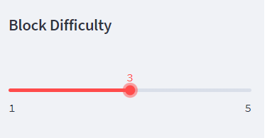

# Banking Blockchain Ledger

Example of a blockchain-based ledger system, complete with a user-friendly web interface. This ledger allows partner banks to conduct financial transactions (that is, to transfer money between senders and receivers) and to verify the integrity of the data in the ledger.  The example demonstrates chaining blocks on the chain via hash linking, proof of work, dynamic adjustments to proof of work difficulty, and blockchain validation.

## Technologies

The application uses the following technologies:

- Python 3.7
- [pandas](https://pandas.pydata.org/pandas-docs/stable/index.html)
- [streamlit](https://streamlit.io)

## Installation Guide (if not using Google Colaboratory)

```python

pip install pandas
pip install streamlit

```

## Usage

There are four blockchain workflows in this demo:

- Adding a transaction to the PyChain blockchain
- Validating the entire PyChain blockchain
- Dynamically adjusting the proof of work difficulty
- Viewing a specific raw block on the PyChain

Blocks for transactions are constructed from user input facilitated through the Streamlit UI.  To launch the application open a terminal and run the following code in the Python virtual environment where Streamlit is installed:

```python

streamlit run app.py

```

### Adding a transaction to the PyChain blockchain


On the **Store a Transaction Record on the PyChain** section of the app:

- Enter the **Sender**, or originator, of the transaction. In the example above *Capital One* was entered.
- Enter the **Receiver**, or recipient, of the transaction. In the example above *Chevron Federal Credit Union* was entered.
- Enter a numeric amount in the **Amount** text box.
- Click the **Add Block** button.

When the transaction has been successfully added to the PyChain, a success message will appear. The amount of time required to add to the blockchain is dependent upon the proof of work difficulty setting in the left bar.  Transactions will appear in the **PyChain Ledger** section of the app for further review.

### Validating the entire PyChain blockchain


Click the **Validate Chain** button to validate the PyChain blockchain.  Each block on the PyChain blockchain contains a SHA-256 hash of all of the *previous* block's encoded attributes.  The chain is validated if every block's "previous hash" matches the actual hash of the previous block all the way from the Genesis (first) block through the last block.

### Dynamically adjusting the proof of work difficulty



The PyChain blockchain uses [proof of work](https://www.investopedia.com/terms/p/proof-work.asp) to secure it from malicious attacks.  In this example the miner must arrive at a hash for the current block that matches a pattern of *beginning zeroes*.  Block objects on the PyChain have a [nonce](https://www.investopedia.com/terms/n/nonce.asp) attribute that can be repeatedly set by miners to programmatically re-hash the block until the *beginning zeroes* requirement is met.  When the requirement is met, the block can be added to the chain. The number of beginning zeroes is set via the **Block Difficulty** slider on the left side of the application.  The newly selected difficulty will take effect the next time the **Add Block** button is clicked to add a transaction.

## Contributors

- Jacob Rougeau

## License

MIT
